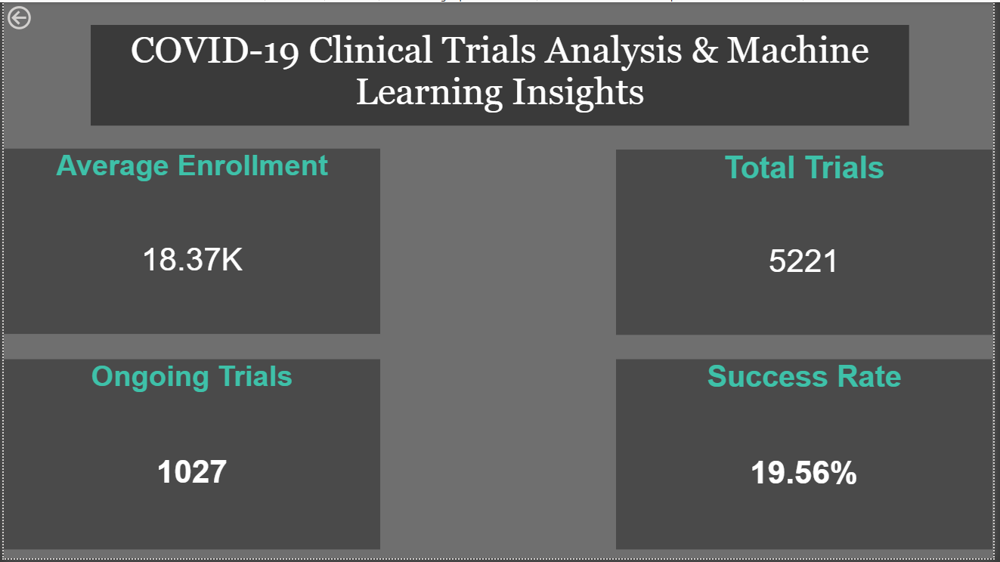
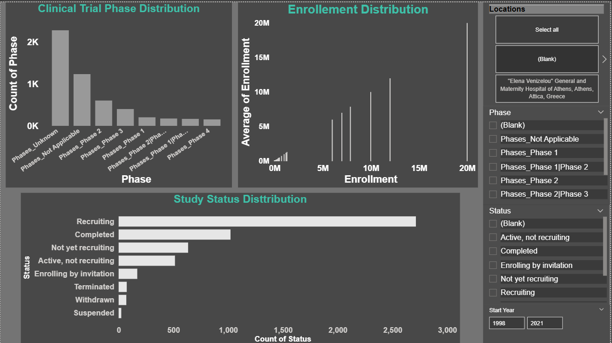
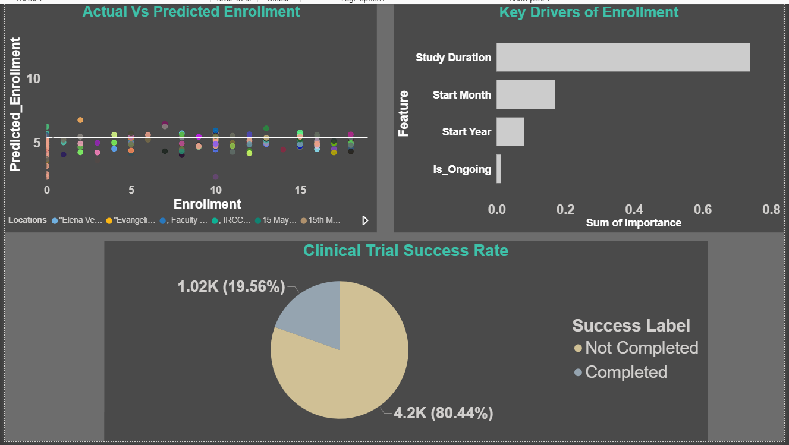
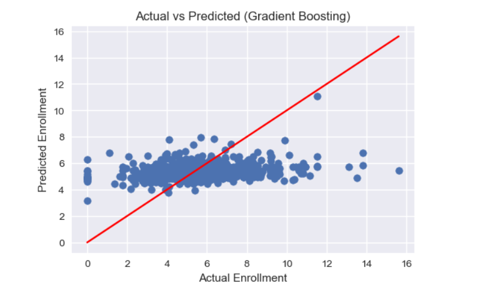
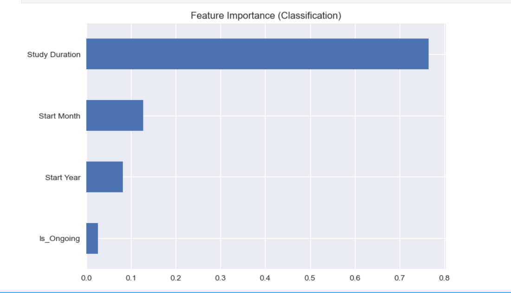
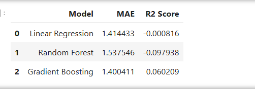

# Covid-Clinical-Trials-Analysis

# 🧪 COVID-19 Clinical Trials Analysis & Machine Learning

## 📌 Project Overview

This project analyzes global COVID-19 clinical trials data to uncover research trends, study patterns, and key insights.
It also applies machine learning models to predict enrollment and study success.

--- 

## Business Problem:
How can we analyze global clinical trials to understand research trends and predict study outcomes?

---

## 🎯 Objectives

* Analyze trends in clinical trials over time
* Identify top countries and organizations conducting trials
* Understand study phases and status distribution
* Apply machine learning for predictive analysis

---

## 🗂️ Project Structure
data/ → Raw dataset
notebooks/ → Jupyter Notebook (EDA + ML)
dashboard/ → Power BI dashboard
outputs/ → Images and ML results

---

## 📊 Dashboard Preview

### 🔹 Overview Dashboard

### 🔹 Research Analysis Dashboard

### 🔹 Machine Learning Dashboard

---

## 📈 Machine Learning Insights

### 🔹 Actual vs Predicted Enrollment

### 🔹 Feature Importance

### 🔹 Model Comparison

---

## 🧠 Key Insights

* Study Duration is the most important factor affecting enrollment
* Most trials are in early phases (Phase 1 & 2)
* Majority of trials are still recruiting or ongoing
* Machine learning models show limited predictive power due to data constraints

---
## Future Scope:
- Add more features for better prediction
- Use advanced models like XGBoost tuning
- Deploy dashboard using Power BI Service

## 🔗 Project Links

* 📊 Dashboard File: Available in `dashboard/` folder
* 📁 Dataset: Available in `data/clinical_trials.csv`
* 📓 Notebook: Available in `notebooks/`

---
